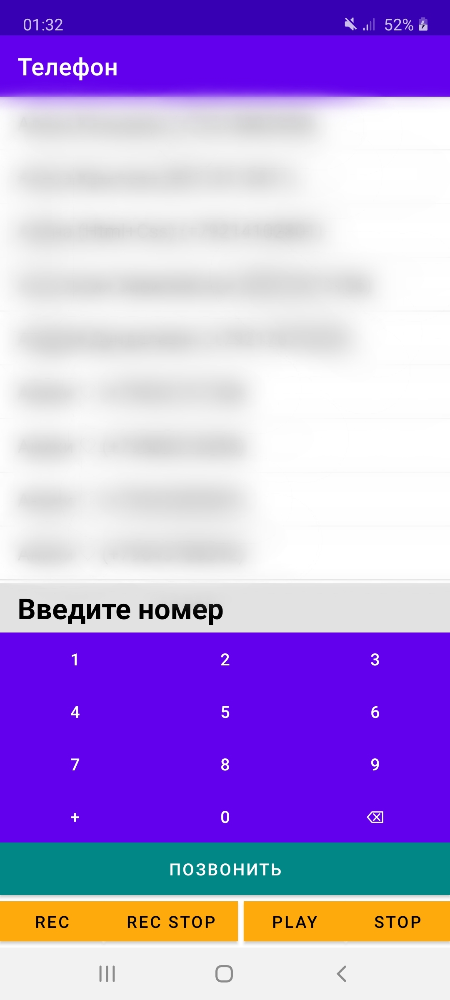

# Dialer
Приложение телефона с возможностями диктофона. Учебный проект

> Внимание! Google запрещает запись аудипотоков во время телефонных разговоров, поэтому если включить диктофон во время звонка, то будет записана тишина

## Интерфейс приложения

Интерфейс приложения имеет секцию с контактами (с целью конфиденциальности телефоны и имена из контактной книжки на скриншоте размыты), поле для ввода номера, клавиатуру с цифрами, кнопку позвонить, а также группу кнопок, отвечающих за запись и воспроизведение:
* кнопка `rec` – начинает запись;
* кнопка `stop rec` – заканчивает запись;
* кнопка `play` – воспроизводит созданную запись;
* кнопка `stop` – останавливает воспроизведение записи.

Запись голоса сохраняется в формате mp3 по пути `/dialer/record.mp3`.

## Структура проекта

В папке `/Dialer/app/src/main` находятся:
* `AndroidManifest.xml` – файл, который предоставляет основную информацию о программе системе, а также содержит описание необходимых разрешений для работы приложения;
* папка `res`, содержащая ресурсы проекта (такие как описание строковых значений, описание дизайна, описание интерфейса приложения, иконку и т.д.);
* папка `java`, содержащая программный код приложения.

В папке `res` был создан файл `…/res/layout/activity_main.xml`, в котором прописан интерфейс приложения. Основный файлы в папке `res` были созданы по умолчанию и не изменялись.

В папке `…/java/com/example/dialer` находятся следующие файлы:
* `MainActivity.java` – файл главного окна приложения; содержит точку входа в приложения и основную его часть;
* `Contact.java` – файл, содержащий класс для описания сущности контакта из адресной книги системы;
* `RecordWorker.java` – файл, содержащий класс с методами для записи звука с микрофона и воспроизведения созданной записи.

Также к репозиторию приложен apk-файл для установки созданного приложения на телефон
